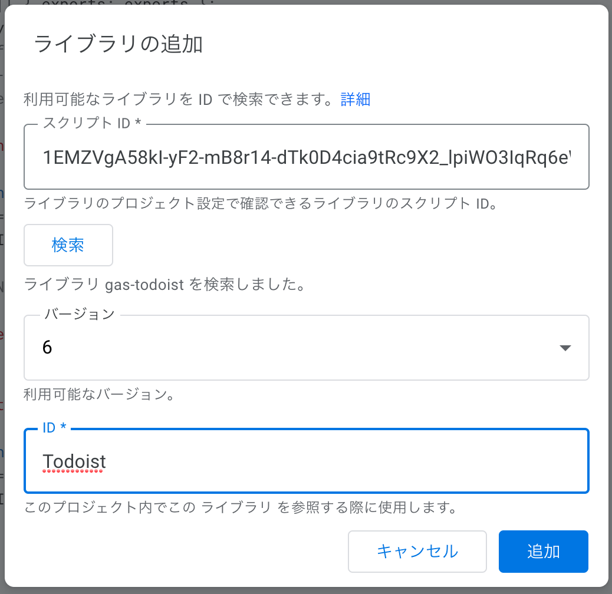

# GAS Todoist

[](https://github.com/google/clasp)

Todoist Client for Google Apps Script.
Use Todoist Sync API.
NOW, only `add_item` command is implemented.

## Instalation

1. Create or Open your GAS project.
2. Select menu [Resource] - [Library], then Library daialog is opened.
3. Input `1EMZVgA58kI-yF2-mB8r14-dTk0D4cia9tRc9X2_lpiWO3IqRq6eWBg-S`, and click *Add* button. 
   
4. Change *Identifier* of this library to `Todoist`
   
5. Click *Save* button.

## Usage

Get API Token `TODOIST_TOKEN` in https://todoist.com/prefs/integrations .

Some samples is below.

```typescript
// create a single task.
function addSingleItem() {
  const task: Todoist.ItemAddArgs = {
    content: 'Single Item',
  };

  const todoist = new Todoist.Client(TODOIST_TOKEN);
  const addedItem = todoist.addItem(task);
}

// create a single task with a note.
function addItemWithNote() {
  const item: Todoist.ItemAddArgs = {
    content: 'Item with Note',
  };
  const note: Todoist.NoteAddArgs = {
    content: 'Note !',
  };

  const todoist = new Todoist.Client(TODOIST_TOKEN);
  const addedItem = todoist.addItem(item, note);
}
```

### Requirements

- Node.js
- Yarn

### How to setup your project
1. Clone this ripository.
2. Install dependencies by `yarn install`
3. Create your GAS project, push code, and open web editor.
   ```console
   $ yarn clasp:create --title gas-todoist --type standalone --rootDir src 
   $ yarn clasp:push
   $ yarn clasp:open
   ```

## Related Documents

- [API Documentation \| Todoist Developer](https://developer.todoist.com/sync/v8/#items)

## LICENSE

[MIT](LICENSE)


